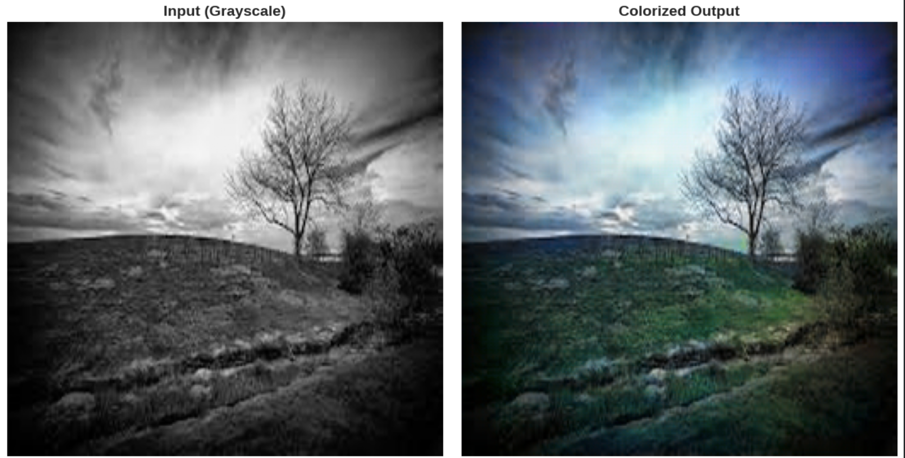

# Deep Image Colorization: ResNet-U-Net GAN with Perceptual Loss and Retrieval Hints

**Course:** COMP3057 Introduction to Artificial Intelligence and Machine Learning  
**Author:** Constantino Harry Alexander (25206605)  
**Date:** December 16, 2025  

<div align="center">
	
	<p><em>Example: Grayscale input (left) colorized by the model (right), showcasing semantic-aware vibrancy.</em></p>
</div>

## Overview
This project implements a conditional Generative Adversarial Network (cGAN) for automatic grayscale image colorization, inspired by Pix2Pix. The goal is to predict chrominance (ab channels in Lab color space) from luminance (L channel), producing vibrant, realistic colors while addressing common issues like desaturation ("sepia effect").

**Key Features:**
- **Generator:** U-Net architecture with a pre-trained ResNet-18 backbone for semantic feature extraction.
- **Discriminator:** PatchGAN for local sharpness and high-frequency details.
- **Enhancements:** Hybrid loss (L1 + adversarial + perceptual via LPIPS) for perceptual realism; optional RAG-inspired retrieval hints using FAISS to provide color priors and mitigate mode collapse.
- **Why Lab Color Space?** Decouples brightness (L) from color (ab), enabling stable conditioning on grayscale inputs with perceptual uniformity.

## Project Goals
- Achieve accurate, semantically plausible colorization with high structural fidelity (e.g., blue skies, green grass).
- Ensure stable GAN training via warmup phases and loss balancing.
- Improve perceptual quality beyond pixel-level metrics using LPIPS.
- Incorporate retrieval-augmented hints for better handling of multimodal color ambiguity.

## Methodology

### Dataset & Preprocessing
- **Source:** [Kaggle Image Colorization Dataset](https://www.kaggle.com/datasets/aayush9753/image-colorization-dataset) (~5,000 natural/landscape images); subset of 1,500 high-quality images selected for GPU efficiency.
- **Preprocessing:**
	- Resize to 256×256 using OpenCV bilinear interpolation.
	- Convert RGB to Lab: Normalize L to [-1, 1] (divide by 50, subtract 1); scale ab to [-1, 1] (divide by 128).
	- Split: 80% train (~1,200), 10% validation (~150), 10% test (~150).
- **Augmentations (Training Only):** Random horizontal flips (p=0.5), rotations (±15°), color jitter (brightness/contrast/saturation=0.3), random resized crops (scale=0.8–1.0), Gaussian blur (kernel=3).
- **Custom Dataset:** `ColorizationDataset` class ensures synchronized L/ab pairs; DataLoaders with batch size 8.

### Network Design
- **Generator (`ResNetUNet`):** 
	- Encoder: Pre-trained ResNet-18 (modified for 1-channel input); extracts semantic features (e.g., recognizing "sky" or "grass").
	- Bottleneck: 9 residual blocks for deep processing.
	- Decoder: Symmetric upsampling with transposed convolutions and skip connections to preserve details.
	- Output: 2-channel ab tensor (tanh activation).
- **Discriminator:** PatchGAN with 4 conv layers + batch norm + LeakyReLU; classifies 70×70 patches of concatenated (L, ab) for local realism.
- **Retrieval Component (Optional RAG-Inspired Hints):**
	- Embeddings: Use ResNet-18 (grayscale-adapted) to generate feature vectors.
	- Index: FAISS `IndexFlatL2` on ~500 training embeddings.
	- Usage: Retrieve nearest neighbor ab maps; blend lightly (e.g., weight 0.2) into generator predictions for color guidance.

### Losses & Optimization
- **Hybrid Loss:**
	- Reconstruction: L1 on ab channels (λ_L1=100, adjusted to 50 for vibrancy).
	- Adversarial: BCEWithLogits to fool discriminator.
	- Perceptual: LPIPS (VGG backbone) on reconstructed RGB for human-like similarity.
	- Total Generator Loss: ℒ_G = ℒ_GAN + λ_L1 ⋅ ℒ_L1 + λ_perc ⋅ ℒ_perc (λ_perc=10).
- **Optimizers:** Adam (lr=2e-4, betas=(0.5, 0.999)) for both G/D; gradient clipping (max_norm=1.0).
- **Schedulers:** StepLR (step=30, gamma=0.1) for learning rate decay.

### Training Procedure
- **Phases:**
	- Warmup (Epochs 1–20): Generator only with L1 loss; discriminator frozen.
	- Full GAN (Epochs 21–120): Alternate G/D updates; early stopping on validation L1.
- **Stability Measures:** Spectral normalization in discriminator; TTUR-like separate optimizers.
- **Duration:** ~1–1.5 hours on Colab Tesla T4 GPU.
- **Checkpoints:** Best (lowest val loss), periodic epochs, final model.
- **Diagnostics:** Live plots of losses, G/D ratio; qualitative previews every 10 epochs.

### Evaluation
- **Metrics:** PSNR (signal quality) and SSIM (structural similarity) on 100 test images.
	- Average: PSNR ~22.53 dB, SSIM ~0.9162 (improved from mid-progress 18.4 dB PSNR).
- **Visualizations:** Galleries of best/worst cases (sorted by SSIM); side-by-side input/output/ground truth; error heatmaps.
- **Analysis:** Strong on semantic scenes; challenges in ambiguous/rare objects due to data bias.

## How to Run

### Requirements
- Python 3.8+
- PyTorch (CUDA supported)
- Libraries: `torchvision`, `scikit-image`, `matplotlib`, `tqdm`, `lpips`, `faiss-cpu`

### Steps
1. **Open Notebook:** Launch `Image_Colorization_ResNet_UNet_GAN.ipynb` in Colab.
2. **Setup & Data:**
	 - Run environment setup cell (installs packages, sets device).
	 - Download dataset via Kaggle API (Colab-integrated); preprocess to Lab space.
3. **Train:**
	 - Execute model definition, loss setup, and training loop cells.
	 - Monitor via plots; adjust hyperparameters if needed.
4. **Evaluate:**
	 - Load best checkpoint.
	 - Run evaluation cell for metrics and galleries.
5. **Local Adaptation:** Update paths for dataset if not on Colab; ensure FAISS index builds correctly.

## Quickstart
- Open the notebook `Image_Colorization_ResNet_UNet_GAN.ipynb` in Google Colab (GPU recommended).
- Or set up locally and run cells top-to-bottom.

### Local Environment Setup
```bash
python -m venv .venv
source .venv/bin/activate
pip install --upgrade pip
pip install torch torchvision torchaudio scikit-image matplotlib tqdm lpips faiss-cpu
```

### Reproducibility (Seed Setup)
```python
import torch, numpy as np, random
seed = 42
random.seed(seed)
np.random.seed(seed)
torch.manual_seed(seed)
torch.cuda.manual_seed_all(seed)
torch.backends.cudnn.deterministic = True
torch.backends.cudnn.benchmark = False
```

### Try It Quickly (Single-Image Inference)
```python
# Given: generator (ResNet-UNet) loaded on device, L in [-1,1] as (1,1,256,256)
with torch.no_grad():
    ab_hat = generator(L.to(device))              # (1,2,256,256), tanh in [-1,1]
from skimage.color import lab2rgb
import numpy as np
L_np  = ((L.cpu().numpy() + 1.0) * 50.0)[0,0]    # [0,100]
ab_np = (ab_hat.cpu().numpy() * 128.0)[0].transpose(1,2,0)  # [-128,127]
lab   = np.dstack([L_np, ab_np])
rgb   = lab2rgb(lab)                              # [0,1]
```

## Ablation Plan (What to Toggle and Expected Effect)
- **No LPIPS (perceptual):** Slightly higher PSNR, lower SSIM/perceived realism (colors less natural).
- **No GAN (L1 only):** Very stable training, good PSNR; outputs look flat/desaturated.
- **Hinge vs. BCE:** Hinge typically stabilizes D and improves color sharpness; recommend hinge for full GAN.
- **No retrieval hint:** More conservative colors; fewer hallucinations but less vibrancy on ambiguous scenes.
- **Lower λ_L1 (100 → 50):** More vibrant colors, small PSNR drop; often better visual quality.

## Troubleshooting
- **ResNet weights won’t download:** Ensure internet access; pre-cache in `~/.cache/torch/hub/checkpoints/` or set `pretrained=False` temporarily.
- **LPIPS errors:** Ensure tensors are NCHW in `[-1,1]`; convert via `rgb*2-1` and place on the same device as `lpips_loss`.
- **FAISS unavailable:** Use `faiss-cpu`; if still unavailable, skip retrieval hints (model works without them).
- **Colors washed out or sepia:** Verify Lab scaling consistency (`L: (L_norm+1)*50`, `ab: tanh*128`) in both train and eval.
- **L1 rises after enabling D:** Use warmup (L1-only), hinge loss, spectral norm in D, TTUR (e.g., G lr 2e-4, D lr 1e-4), and gradient clipping.
- **CUDA OOM:** Reduce batch size or disable some augmentations (e.g., heavy ColorJitter).

## Key Hyperparameters
- Image Size: 256×256
- Batch Size: 8
- Epochs: 120 (warmup 20)
- Learning Rate: 2e-4
- λ_L1: 100 (initial), 50 (adjusted)
- λ_Perc: 10

## Results Summary
- **Quantitative:** Improved PSNR/SSIM with perceptual loss.
- **Qualitative:** Vibrant outputs; see notebook galleries for examples.
- **Challenges:** Minor artifacts in complex scenes; addressed via retrieval hints.

## Notes & Tips
- **Common Issues:** If ResNet weights fail to download, check internet or use offline cache. LPIPS requires proper RGB normalization.
- **Extensions:** Enable retrieval hints for better vibrancy; experiment with diffusion models for SOTA.
- **Reproducibility:** Seed set for consistent runs; full code self-contained.

## Repository Structure
```
├── README.md                  # This file
├── Image_Colorization_ResNet_UNet_GAN.ipynb  # Main Jupyter notebook
├── Images/                    # Visuals (e.g., ProjectHeader.png, results galleries)
├── colorizer_*.pth            # Saved models (generated during training)
└── data/                      # Dataset directory (populated during run)
```

## Acknowledgements
- Inspired by Pix2Pix (Isola et al., 2017), U-Net (Ronneberger et al., 2015), and Colorful Image Colorization (Zhang et al., 2016).
- Libraries: PyTorch, LPIPS, FAISS.
- Dataset: Shah (2021) on Kaggle.
- Thanks to Dr. Ren Jie Wan for guidance.

## References
- Isola et al., 2017. "Image-to-Image Translation with Conditional Adversarial Networks (Pix2Pix)".
- Ronneberger et al., 2015. "U-Net: Convolutional Networks for Biomedical Image Segmentation".
- Zhang et al., 2016. "Colorful Image Colorization".
- Zhang et al., 2018. "The Unreasonable Effectiveness of Deep Features as a Perceptual Metric (LPIPS)".
- Johnson et al., 2016. "Perceptual Losses for Real-Time Style Transfer and Super-Resolution".
